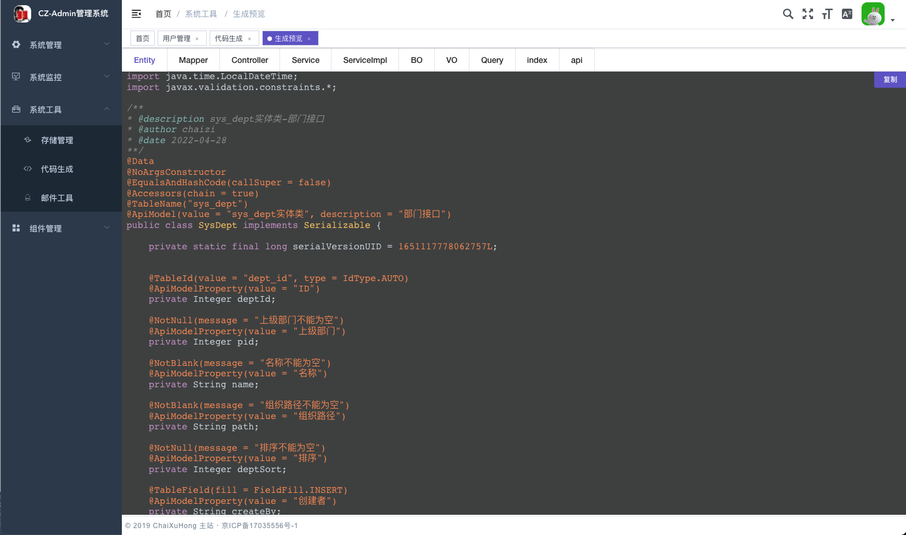

# 项目展示

+ 登录页

  

+ 首页

  

+ 用户管理

  

- 代码生成

  

# 后端技术架构

- SpringBoot 2.5.8 基础框架
- MybatisPlus  ORM框架
- MybatisPlusJoin 插件
- Mysql  数据库
- HikariCP 数据库连接池
- Redis 缓存
- SpringBootSecurity 权限框架
- Hutools 工具类
- Freemarker 模板引擎
- ...

# 前端技术架构

- VUE 2.6  基础框架 包括（Vue-Router,VueX）
- Axios 请求依赖
- Element-UI UI框架
- Vue-Echarts 图表库
- Wangeditor5  富文本编辑器
- MavonEditor MarkDown编辑器
- Highlight、Prism 代码高亮插件
- ...

 
