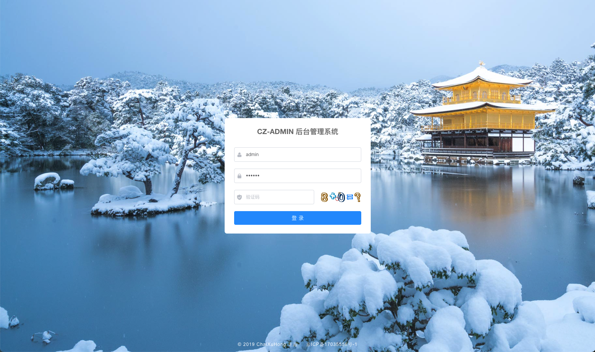

# CZAdmin管理后台

如需开发管理后台，可以直接拿来用，在此基础上进行业务开发。省去了用户、菜单、角色、部门、岗位、权限控制、文件管理等等基础功能开发，且代码生成功能节省70%搬砖工作

数据库表结构`sql`在`doc/sql`中

# 项目展示

+ 登录页

  

+ 首页

  

+ 用户管理

  

- 代码生成

  

# 应用场景

- 这是一套纯后台管理的系统，没有任务业务成分在里面。所以适合任何业务后台管理系统，直接拿来当做基础。在此之上进行直接的业务构建。
- 完备的菜单权限、按钮权限、接口权限、数据权限控制
- 基于表结构的**代码生成**功能，直接生成前后端代码，扔到项目里，后端完全不需要改动，直接启动，前端需要改下index的api文件路径。对于列表UI的功能包括增删改查导出，直接用。
- **邮件**工具可以直接进行发邮件，此场景主要用于后端服务，比如定时任务跑批时候，成功失败可能需要通知管理员。

# 功能说明

- 系统管理
  - 用户管理：用户列表、用户crud操作、用户角色授权、部门分配、岗位分配
  - 角色管理：角色列表、角色crud操作、角色菜单授权、角色数据权限控制（通过部门进行数据过滤）
  - 菜单管理：菜单列表、菜单crud操作
  - 岗位管理：岗位列表、岗位crud操作
  - 字典管理：字典列表、字典crud操作
- 系统监控
  - 在线用户：在线用户列表、强踢用户下线
  - 操作日志：日志列表、导出、清空日志表操作数据
  - 异常日志：日志列表、导出、清空日志表异常数据、查看日常信息
  - 服务监控：查看服务器硬件使用情况
- 系统工具：
  - 存储管理：文件列表，文件crud操作
  - 代码生成：数据库表列表，生成配置、生成预览、生成功能、下载代码
  - 邮件工具：邮件配置列表，配置crud操作，发送邮件
- 组件管理：
  - 图表库：Echart图表使用展示
  - 富文本：富文本编辑器组件
  - Markdown：Markdown编辑器组件

# 后端技术架构

- SpringBoot 2.5.8 基础框架
- MybatisPlus  ORM框架
- MybatisPlusJoin 插件
- Mysql  数据库
- HikariCP 数据库连接池
- Redis 缓存
- SpringBootSecurity 权限框架
- Hutools 工具类
- Freemarker 模板引擎
- ...

# 前端技术架构

- VUE 2.6  基础框架 包括（Vue-Router,VueX）
- Axios 请求依赖
- Element-UI UI框架
- Vue-Echarts 图表库
- Wangeditor5  富文本编辑器
- MavonEditor MarkDown编辑器
- Highlight、Prism 代码高亮插件
- ...

# 使用说明

## 后端

- **权限标识**：权限标识前后端需要一致，后端控制接口访问权限，前端控制是否按钮显示

  - 后端: `@PreAuthorize("hasAuthority('user:add')") //user:add 权限标识`
  - 前端有两种：
    - `v-permission*="['user:add']"` 控制Dom的显示
    - `v-if="checkPer(['user:send'])"` 控制如Element-UI的table的整个列是否渲染

- **数据权限**：

  ```java
  @DataScope
  public class SysDeptQuery 
  ```

  - 在Query查询类上增加@DataScope注解，封装好的查询类会自动去关联部门表进行过滤数据

- **数据查询**：

  ```java
  @Override
  public IPage<SysDept> queryAll(SysDeptQuery query, Pageable pageable){
    PageUtil<SysDept> pageUtil = new PageUtil<>(pageable);
    MPJQueryWrapper<SysDept> wrapper = QueryUtil.buildWrapper(query,SysDept.class);
    return this.page(pageUtil,wrapper);
  }
  ```

  - PageUtil：封装的处理分页、排序工具类
  - QueryUtil： 封装的处理查询条件工具类、包括数据过滤功能

- **日志记录**

  在需要记录日志的方法上增加注解：**@Logger("新增用户")**即可，自动记录方法名、入参、返回结果、异常信息、调用IP、操作人等等信息

## 前端 

- **菜单Tab页缓存**：必须保证菜单配置中的**组件名称**与代码里的**name**属性一致，才能进行缓存本业数据。如发送邮件功能，富文本编辑了很多，不小心切到别的tab，再切回来需要仍然有之前编辑的数据，就需要用到菜单Tab页缓存功能

- **CRUD组件**：封装好的操作组件，利用vue的混入特性

- **国际化**：目前只支持中英切换，**只需要**在`lang/zh.js`进行配置 *中英文对照* ，将需要切换的位置用全局函数`$t`包裹即可，`en.js`会读取`zh.js`里的配置，

- **EsLint**: EsLint每人开发工具配置不同，可以关闭检查功能，也可能直接使用我的vsCode-eslint配置，如下：

  ```json
  {
    // 默认配置
    // "vetur.format.defaultFormatter.html": "prettyhtml", // html格式化
    "vetur.format.defaultFormatter.css": "prettier", //  css
    "vetur.format.defaultFormatter.postcss": "prettier", // postcss
    "vetur.format.defaultFormatter.scss": "prettier", // scss
    "vetur.format.defaultFormatter.less": "prettier", // less
    "vetur.format.defaultFormatter.stylus": "stylus-supremacy", //stylus
    // "vetur.format.defaultFormatter.js": "prettier", // 重新设置
    "vetur.format.defaultFormatter.ts": "prettier", // ts
    "vetur.format.defaultFormatter.sass": "sass-formatter", // sass
    "editor.fontSize": 14,
    "[json]": {
      "editor.defaultFormatter": "vscode.json-language-features"
    },
    "[javascript]": {
      "editor.defaultFormatter": "vscode.typescript-language-features"
    },
    "[vue]": {
      "editor.defaultFormatter": "octref.vetur"
    },
    "workbench.colorTheme": "Monokai Pro",
    "workbench.iconTheme": "vscode-icons",
    "editor.detectIndentation": false,
    // 重新设定tabsize
    "editor.tabSize": 2,
    // #每次保存的时候自动格式化
    "editor.formatOnSave": true,
    "eslint.validate": [
      "javascript",
      "javascriptreact",
      "html",
      "vue"
    ],
    // #每次保存的时候将代码按eslint格式进行修复
    "editor.codeActionsOnSave": {
      "source.fixAll.eslint": true
    },
    //  #让函数(名)和后面的括号之间加个空格
    "javascript.format.insertSpaceBeforeFunctionParenthesis": true,
    // #这个按用户自身习惯选择
    "vetur.format.defaultFormatter.js": "vscode-typescript",
    "vetur.format.defaultFormatter.html": "js-beautify-html",
    "vetur.ignoreProjectWarning": true,
    // #让vue中的js按编辑器自带的ts格式进行格式化
    "vetur.format.options.tabSize": 2,
    "vetur.format.options.useTabs": false,
    "vetur.format.defaultFormatterOptions": {
      "js-beautify-html": {
        "wrap_line_length": 120,
        "wrap_attributes": "aligned-multiple",
        // "end_with_newline": true
        // #vue组件中html代码格式化样式
      },
      "prettier": {
        "semi": false,
        "singleQuote": true,
        "eslintIntegration": true
      }
    },
    "vetur.validation.template": false,
    "[html]": {
      "editor.defaultFormatter": "SimonSiefke.prettier-vscode"
    },
    "workbench.editorAssociations": {
      "*.class": "default"
    },
    "vsicons.dontShowNewVersionMessage": true,
    "bracketPairColorizer.depreciation-notice": false,
    // 关闭右侧预览
    "editor.minimap.enabled": false,
    "javascript.updateImportsOnFileMove.enabled": "always",
    "eslint.nodeEnv": ""
  }
  ```

  


